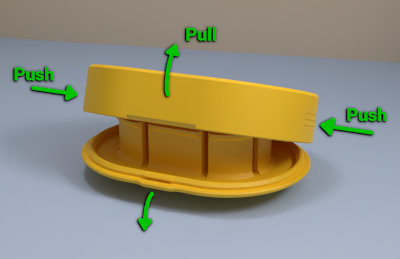

# Hinged Case for Earphones (separate parts remix)
*3D printable protection case for earphones (formerly thing:2654324)*

### License
[Creative Commons - Attribution](https://creativecommons.org/licenses/by/4.0/)

### Attribution
This is a remix of yyh1002's Hinged Case for Earphones ([Thingiverse thing:2548489](https://www.thingiverse.com/thing:2548489)).

### Gallery

[🔎](images/case1.jpg) [🔎](images/case2.jpg) [🔎](images/case3.jpg) [🔎](images/case4.jpg) [🔎](images/case5.jpg)

## Description and Instructions

This is yyh1002's [hinged case](https://www.thingiverse.com/thing:2548489) for wired earphones, with the following modifications:

1. Printed in **two separate pieces** that snap together. This avoids the need for supports, and allows for a nice finish on both the lid and the bottom (especially if you have a glass bed or a similar smooth printing surface). Plus, you can print the lid and box in different colors.
2. The lid catch mechanism is tighter to reduce the risk of it opening spontaneously.
3. The regular models have thinner top and bottom shells to reduce material and time needed for printing. The thinner lid also offers one extra millimeter of room. These 1 mm shells should still be more than strong enough for average use. If not, you can use the `thick` files which have the same 2 mm thickness as the original.
4. Deeper versions of the boxes (`deeper` in file names), in case you can use 2 mm of extra wiggle room. Especially useful if you need to store extra adapters in the case, thanks to certain companies believing it was a good idea to omit the headphone jack.
5. An alternative set of models that are 5 mm longer than the regular ones. These may be more suitable for earphones with extra buttons or controls attached to the wires.
6. Can also be printed as a general-purpose box with no internal structures (`plain` models).

You can combine *any* of the box and lid files within each subfolder, they all fit together. (Obviously the longer models don't fit the regular ones.)

To assemble the hinge, push it together from the inside (small recesses are provided to facilitate this) as shown in the *Post-Printing* section below.

If you have difficulty opening the box, press it at the sides (lengthwise). This will make it pop open much more easily. If this doesn't suffice, or the box doesn't stay shut by itself, see *Post-Printing* for a way to correct it.

[🔎](images/opening.jpg)

*The easiest way to open the case is to push on the sides while pulling on the lid.*

### Print Settings I've used

I printed this at 0.2 mm layers, no supports or rafts, with 25% infill. Use 3 perimeters for improved strength. 
The filament in the photos is Polaroid ‘Gold’ PLA (which is rather just a dark yellow with a tiny hint of sparkle) and white PETG. Both these materials work well, but PETG will be more durable.

Print slowly and apply only the minimum of cooling needed to maximize the strength of the print.

### Post-Printing

Assemble the hinge as shown in the picture: insert one end of the hinge into its socket, and push the other one in place from the inside. You may need quite a bit of force. If the print breaks while trying this, it isn't strong enough to protect your earphones anyway and you should review your print settings…

[🔎](images/hinge-assembly.jpg)

The lid closing mechanism should work fine on a well-made print but if it doesn't stay shut, you can fix it by heating up the side of the box and pushing it inwards a little. This will make the catch mechanism tighter. This is easiest with PLA, which can be temporarily softened by applying a hairdryer for about 10 seconds. With PETG this should also work if your hairdryer is hot enough. 
If the latch is too tight, sand it or scrape the catch on the lid to remove some material.

## Updates

### 2017/11/18
First published on Thingiverse.

### 2018/08/02
Added a small ‘lip’ to the lid so it is easier to open (suggested by [jemete](https://www.thingiverse.com/jemete)).

### 2019/04/21
Added ‘L5’ variations on the models, which are 5 mm longer.

### 2019/06/02
Added small ridges on the sides of the box to make it more obvious how to easily open it. Also rotated all models 90°.

### 2020/05/13
Migrated to GitHub.

### 2022/08/15
Made latch tolerances even tighter because it still tended to be too sloppy, and slightly tweaked lids to make it easier to open the box by squeezing the sides. Added deeper box variants and Blender source file.

## Tags
`box`, `case`, `earbud`, `earphone`, `earphones`, `earphone_holder`, `headphones`, `hinge`
